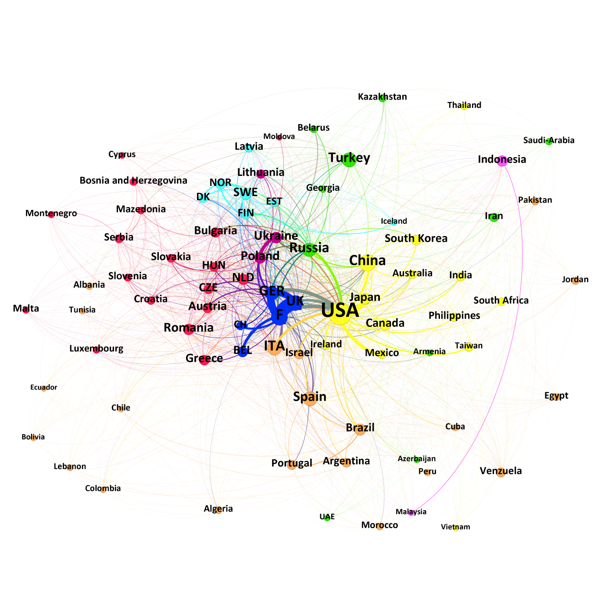

<!-- README.md is generated from README.Rmd -->

```{r, echo = FALSE}
knitr::opts_chunk$set(
  collapse = TRUE,
  comment = "#>",
  fig.path = "README-"
)
```

# The Choice of Partner – National Influence Factors on the Founding of Sister Cities


<div align="center">*Seule Paris est digne de Rome; seule Rome est digne de Paris.*</div>
<div align="center">*Solo Parigi è degna di Roma; solo Roma è degna di Parigi.*</div>
<div align="center">*Only Paris is worthy of Rome; only Rome is worthy of Paris.*</div>
<div align="center">(City of Rome 2016)</div>

Sister cities are a possibility for cities to connect themselves within a globalized world. This paper elaborates which national factors are decisive for cities to pair with others. Initially, several potentially important factors which could influence the number of twinnings between two countries were identified theoretically and according hypotheses were formulated. These assumptions were tested by applying a mixed methods design. Initially, the global network of sister cities was mapped visually in a network analysis approach. A qualitative analysis of this network suggested that proximity, historical and cultural bounds are especially relevant national factors that drive the foundation of such partnerships. In a second step, these variables are tested quantitatively. A shared border, trade, and a history of war proved to be relevant factors influencing the decision on where cities look for partners. 

Please see the manuscript in this folder for the complete draft. 

## Visualization of the sister cities network

<div align="center"></div>

Figure 2: International network of sister cities


Figure 3: Geographical network of countries. The size of the nodes corresponds to the weighted degrees.


___
Please cite the complete manuscript, available in this folder, when referring to this research as:

Kleinert, Manuel (2019): The Choice of Partner – National Influence Factors on the Founding of Sister Cities, working paper.


